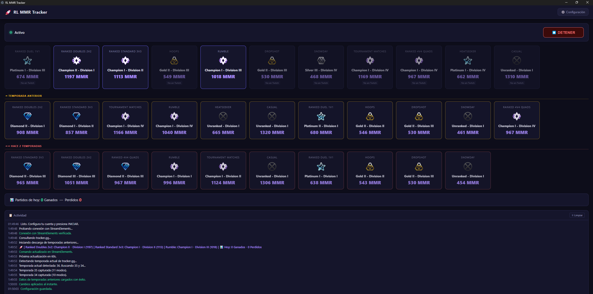
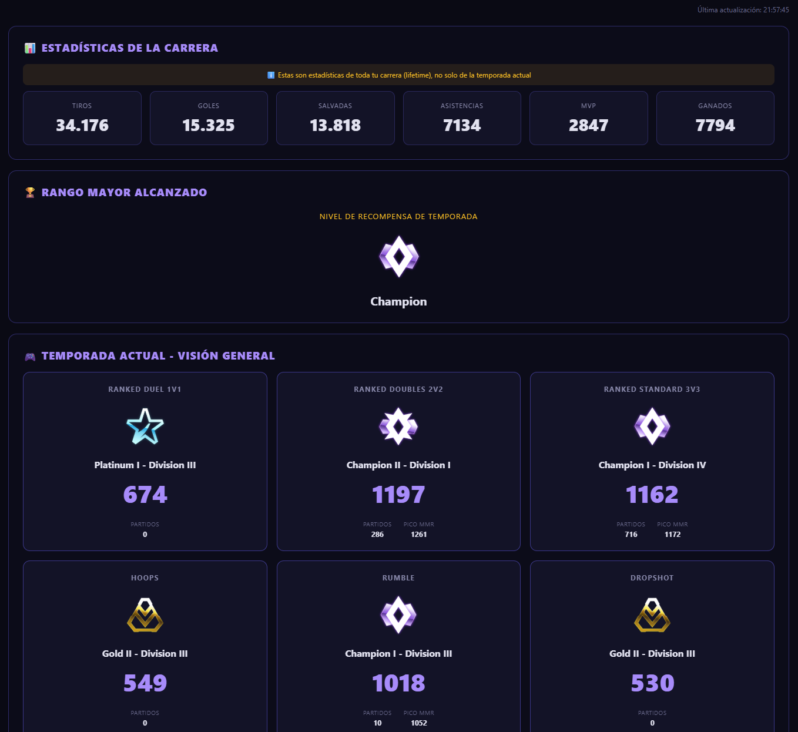
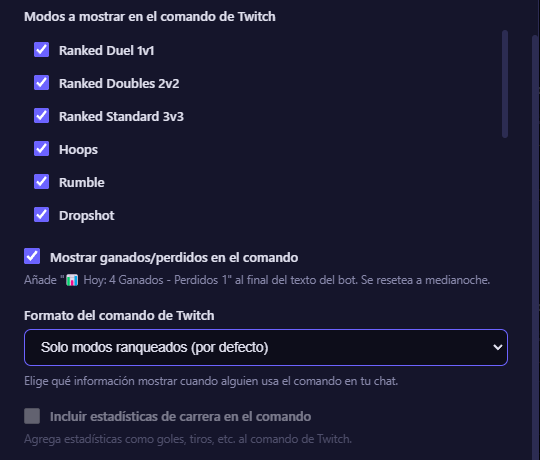
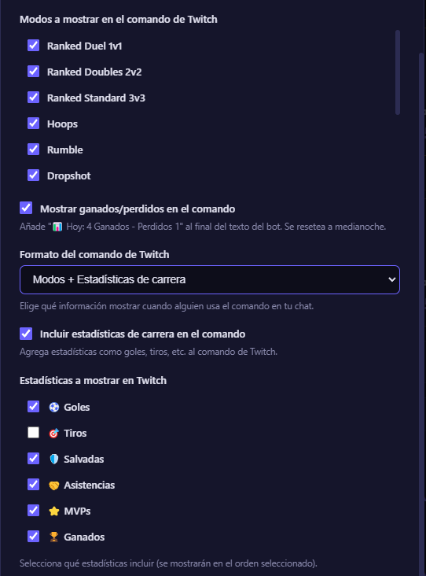
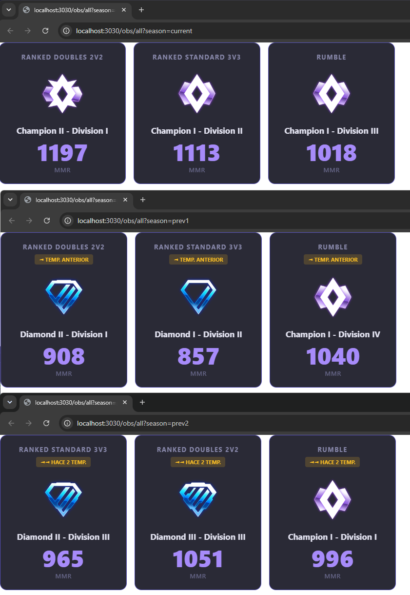

# RL MMR Tracker

Aplicacion de escritorio para streamers de Rocket League que rastrea tu MMR competitivo y actualiza el comando de tu bot de StreamElements automaticamente.

> Repositorio: https://github.com/SiliusJM/rl-mmr-tracker

---

## Capturas

| Tracker activo | Configuracion | Resultado en Twitch | Temporadas |
|---|---|---|---|
|  |  |  |  |

| Perfil Completo | Formato Comando Twitch | Estadísticas en Comando | URL en OBS |
|---|---|---|---|
|  |  |  |  |

> Para ver las capturas en GitHub se encuentra dentro de la carpeta `assets/screenshots/`.

---

## Caracteristicas

### Tracking de MMR y Rangos
- Muestra todos los modos clasificados de tu perfil (1v1, 2v2, 3v3, Rumble, Hoops, Dropshot, Snowday...)
- **Modos auto-detectados desde la API** -- si Psyonix agrega o elimina un modo, la app lo refleja automaticamente sin actualizaciones
- Contador de ganados/perdidos del dia (se resetea a medianoche)
- Soporte para temporadas anteriores (hasta 2 temporadas atrás)

### Vista de Perfil Completo (OBS)
- **URL:** `http://localhost:3030/obs/profile`
- Estadísticas de la carrera: Tiros, Goles, Salvadas, Asistencias, MVPs, Ganados
- Rango mayor alcanzado en la temporada
- Visión general de todos tus modos ranqueados con:
  - Rango y MMR actual
  - Partidos jugados
  - Pico de MMR alcanzado
- Actualización automática cada 5 segundos
- Diseño profesional con fondo oscuro
- Grid de 3 columnas con scroll horizontal para ver todos los modos

### Comando de Twitch Personalizable
Elige qué información mostrar en tu chat:
- **Solo modos:** Muestra rangos y MMR (comportamiento por defecto)
- **Solo estadísticas:** Muestra goles, tiros, salvadas, etc. de toda la carrera
- **Ambos:** Combinación de modos + estadísticas

Selecciona exactamente qué estadísticas incluir:
- ⚽ Goles
- 🎯 Tiros
- 🛡️ Salvadas
- 🤝 Asistencias
- ⭐ MVPs
- 🏆 Ganados

### Interfaz y Experiencia
- UI oscura con log de actividad en tiempo real
- Configuracion guardada localmente en `config.json` (no se sube a GitHub)
- Servidor OBS integrado para overlays personalizados
- Compatible con todas las plataformas: Epic Games, Steam, PlayStation, Xbox

---

## Inicio rapido (despues de `git clone`)

### Requisitos previos

- [Node.js v18 o superior](https://nodejs.org) -- solo esto es necesario.
- Una cuenta de [StreamElements](https://streamelements.com) con el bot activado en tu canal.

### Primer uso

1. Clona el repositorio:
   ```bash
   git clone https://github.com/SiliusJM/rl-mmr-tracker.git
   cd rl-mmr-tracker
   ```
2. Haz doble clic en **`Iniciar.bat`**.
   - La primera vez detecta que `node_modules/` no existe y ejecuta `npm install` automaticamente (puede tardar 1-2 minutos dependiendo de tu internet).
   - Las siguientes veces abre la app directamente.
3. Haz clic en **Configuracion**, completa los campos y guarda.
4. Presiona **INICIAR**.
5. Despues del primer ciclo abre **Configuracion**, selecciona los modos que quieres en tu chat y guarda.

> Si prefieres la linea de comandos: `npm install` una sola vez, luego `npm start` cada vez.

---

## Guia de configuracion

### 1. Cuenta de juego

| Campo | Que poner |
|---|---|
| Plataforma | `Epic Games`, `Steam`, `PSN` o `Xbox Live` |
| Nombre de usuario | Tu nombre exacto en Rocket League (ej: `SILIUS XIX YT`). Los espacios se incluyen. |

### 2. StreamElements -- Twitch o YouTube

StreamElements funciona tanto si vinculaste Twitch como YouTube. Cada plataforma tiene su propio Channel ID dentro de StreamElements.

1. Ve a [streamelements.com](https://streamelements.com) e inicia sesion.
2. Haz clic en tu avatar (arriba a la derecha) -> **Mi Cuenta** o **Channel settings** -> pestana **Channels**.
3. **JWT Token:** copialo desde la columna JWT Token. Empieza con `eyJ...`
4. **Account ID / Channel ID:** copialo desde la columna Account ID (ej: `69f239c3...`).
   - Si tienes Twitch Y YouTube vinculados, asegurate de copiar los datos del canal donde tienes el bot de StreamElements **activo**, no el otro.

> **Importante:** mezclar el Account ID de una plataforma con el bot activo en la otra causa error de conexion aunque el JWT Token sea correcto.

### 3. Comando de chat

- **Nombre:** el comando que usaran los viewers (ej: `rangoo` -> el viewer escribe `!rangoo`).
- El tracker actualiza ese comando automaticamente en cada ciclo.

---

## Uso de recursos y rendimiento

El tracker esta disenado para correr en segundo plano sin afectar tu juego ni tu internet.

| Recurso | Consumo aproximado |
|---|---|
| **RAM** | ~180-250 MB (Electron + Chromium en modo headless) |
| **CPU** | <1% en reposo. Pico de 5-10% durante ~3-5 segundos por ciclo de actualizacion |
| **Red** | ~0.5-2 MB por ciclo (carga la pagina del perfil en tracker.gg) |
| **Disco** | Sin escritura continua. Solo guarda `config.json` al cambiar configuracion |

**Impacto real en streaming/gaming: ninguno.**
- El navegador corre headless (sin ventana visible) y solo se activa durante el scraping.
- El intervalo minimo es de 30 segundos; con 60 segundos (por defecto) el consumo es casi imperceptible.
- No interfiere con OBS, Rocket League ni con el ancho de banda de tu partida.

---

## Sobre los modos -- se actualiza si Psyonix agrega o elimina alguno?

**Si, completamente automatico.** El programa no tiene ninguna lista de modos escrita en el codigo. En cada ciclo consulta la API de tracker.gg y lee los modos disponibles en ese momento. Esto significa:

- Si Psyonix **elimina** un modo (ej. Snowday deja de tener ranked), desaparece solo de la app.
- Si Psyonix **agrega** un modo nuevo, aparece en la app en el siguiente ciclo sin actualizar nada.
- Los modos que no hayas jugado o que no aparezcan en tu perfil simplemente no se muestran.

**No requiere mantenimiento del codigo.**

---

## Ejemplo del comando en chat

### Formato: Solo Modos (por defecto)
```
🚀 Ranked Doubles 2v2: Champion II (1197) | Ranked Standard 3v3: Champion I (1162) | 📊 Hoy: 4 Ganados - 1 Perdidos
```

### Formato: Solo Estadísticas
```
🚀 ⚽ 15,325 Goles | 🎯 34,176 Tiros | 🛡️ 13,818 Salvadas | 🤝 7,134 Asistencias
```

### Formato: Ambos
```
🚀 Ranked Doubles 2v2: Champion II (1197) | ⚽ 15,325 Goles | 🎯 34,176 Tiros | 📊 Hoy: 4 Ganados - 1 Perdidos
```

---

## OBS Overlays

El tracker incluye un servidor HTTP local que proporciona varias vistas para usar como fuentes de navegador en OBS:

### Vista de Perfil Completo
**URL:** `http://localhost:3030/obs/profile`

Muestra tu perfil completo de Rocket League con:
- Estadísticas de la carrera (Tiros, Goles, Salvadas, Asistencias, MVPs, Ganados)
- Rango mayor alcanzado
- Todos tus modos ranqueados con detalles completos

**Configuración en OBS:**
1. Fuentes → + → Fuente de navegador
2. URL: `http://localhost:3030/obs/profile`
3. Tamaño: 1200×900 px (recomendado)
4. **NO** marcar "Fondo transparente" (la vista tiene su propio fondo)

### Otras Vistas Disponibles
Para ver todas las vistas disponibles (modos individuales, sesión, etc.), abre en tu navegador:
```
http://localhost:3030
```

**Nota:** El puerto por defecto es 3030, pero puedes cambiarlo en Configuración → OBS Overlay.

---

## Limitaciones Importantes

### Estadísticas por Temporada

Las estadísticas mostradas (Tiros, Goles, Salvadas, Asistencias, MVPs, Ganados) son de **TODA tu carrera** (lifetime), no solo de la temporada actual.

**¿Por qué?**
- La API de tracker.gg no proporciona estadísticas separadas por temporada
- Epic Games no tiene una API pública para datos históricos por temporada
- Los datos que ves en el cliente de Epic provienen de bases de datos privadas

**Lo que SÍ está disponible por temporada (por modo):**
- ✅ Partidos jugados
- ✅ Racha de victorias/derrotas
- ✅ Pico de MMR alcanzado
- ✅ Rango actual

**Lo que NO está disponible por temporada:**
- ❌ Tiros de la temporada
- ❌ Goles de la temporada
- ❌ Salvadas de la temporada
- ❌ Tiempo jugado
- ❌ % de victorias exacto

Esto es una limitación de las APIs públicas disponibles, no del tracker.

---

## Nota sobre el intervalo de actualizacion

El "Update in 3:18" que ves en tracker.gg es el cache del **sitio web**, no el de esta app. La app consulta la API en el intervalo que configures (60 segundos por defecto, minimo 30 s).

### Cuanto tarda en actualizarse el contador de Ganados/Perdidos?

El contador de **📊 Partidos de hoy** en la UI y en el comando de chat se actualiza en cada ciclo de polling:

- Con el intervalo por defecto de **60 segundos**, el contador puede tardar hasta **60 s** en reflejar el resultado de una partida.
- El minimo configurable es **30 segundos**.
- El contador detecta cambios comparando el MMR de cada modo entre ciclos: si sube es victoria, si baja es derrota.
- Se resetea automaticamente a medianoche (cambio de dia).

---

## Estructura del proyecto

```
rl-mmr-tracker/
├── main.js                    # Proceso principal de Electron
├── preload.js                 # Puente IPC seguro (contextBridge)
├── scraper.js                 # Scraper de tracker.gg (puppeteer-extra + stealth)
├── streamElements.js          # Cliente API de StreamElements
├── sessionTracker.js          # Contador de ganados/perdidos
├── obs-server.js              # Servidor HTTP para overlays de OBS
├── renderer/
│   ├── index.html             # UI principal
│   ├── app.js                 # Logica del frontend
│   └── style.css              # Tema oscuro
├── assets/
│   └── screenshots/           # Capturas para el README
├── Iniciar.bat                # Lanzador Windows (auto-instala dependencias)
├── package.json
└── .gitignore                 # config.json y tokens no se suben
```

> **Seguridad:** `config.json` (contiene nombre de usuario, JWT Token y Channel ID) esta en `.gitignore` y nunca se sube a los repositorios. Cada usuario configura sus propios datos localmente.

---

## Changelog - Versión 1.2.0

### Nuevas Funcionalidades

**Vista de Perfil Completo para OBS**
- Nueva URL: `http://localhost:3030/obs/profile`
- Muestra estadísticas de carrera (Tiros, Goles, Salvadas, Asistencias, MVPs, Ganados)
- Rango mayor alcanzado con icono
- Visión general de todos los modos ranqueados
- Actualización automática cada 5 segundos

**Comando de Twitch Personalizable**
- 3 formatos disponibles: Solo modos, Solo estadísticas, Ambos
- Selección individual de qué estadísticas mostrar
- Configuración flexible desde la interfaz

**Mejoras en el Scraper**
- Extracción de estadísticas de carrera (lifetime)
- Datos extendidos por modo: partidos jugados, rachas, pico de MMR
- Mejor manejo de datos de temporadas anteriores

---

## Construir instalador .exe (opcional)

```bash
npm run dist
```

El instalador aparece en la carpeta `dist/`.

---

## Licencia

MIT