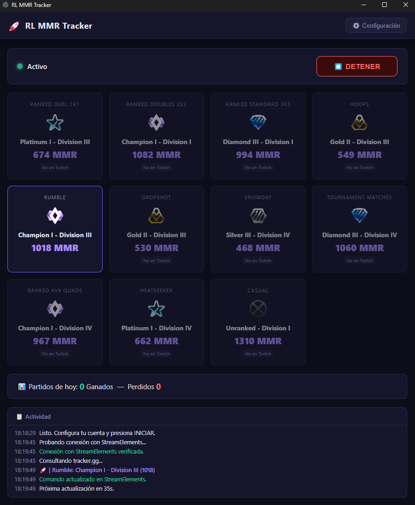
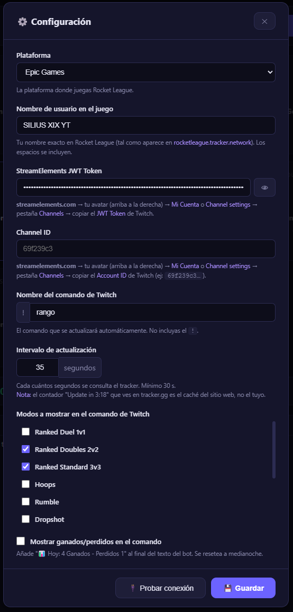
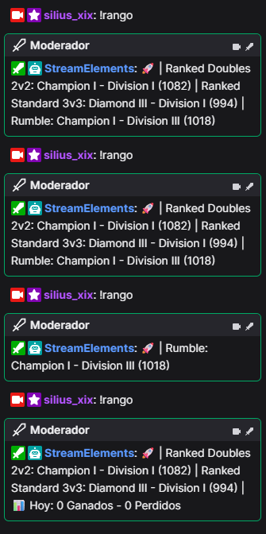
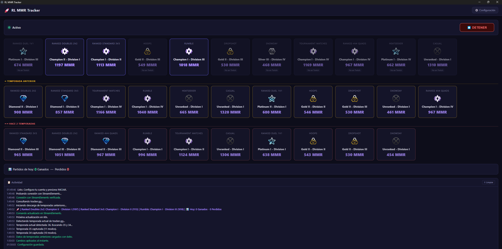
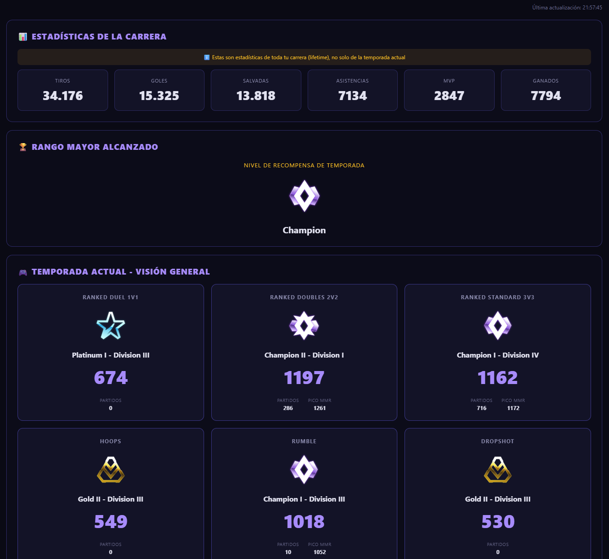
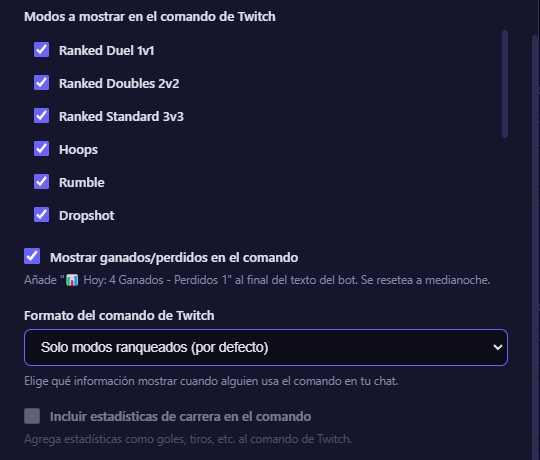
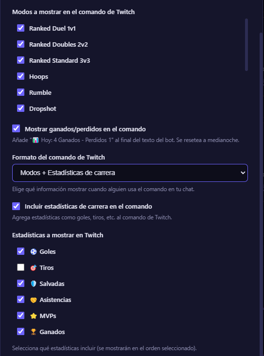
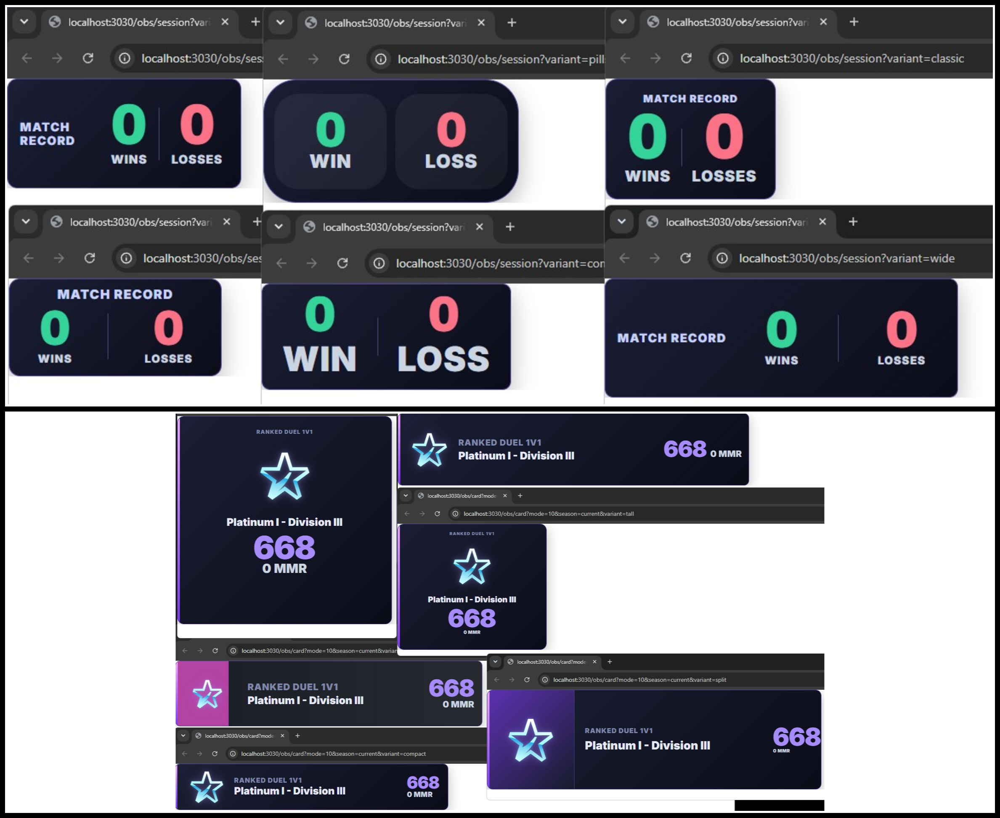

# RL MMR Tracker

Aplicacion de escritorio para streamers de Rocket League que rastrea tu MMR competitivo y actualiza el comando de tu bot de StreamElements automaticamente.

> Repositorio: https://github.com/SiliusJM/rl-mmr-tracker

---

## Capturas

| Tracker activo | Configuracion | Resultado en Twitch | Temporadas |
|---|---|---|---|
|  |  |  |  |

| Perfil Completo | Formato Comando Twitch | Estadísticas en Comando | URL en OBS |
|---|---|---|---|
|  |  |  |  |

> Para ver las capturas en GitHub se encuentra dentro de la carpeta `assets/screenshots/`.

---

## Caracteristicas

### Tracking de MMR y Rangos
- Muestra todos los modos clasificados de tu perfil (1v1, 2v2, 3v3, Rumble, Hoops, Dropshot, Snowday...)
- **Modos auto-detectados desde la API** -- si Psyonix agrega o elimina un modo, la app lo refleja automaticamente sin actualizaciones
- Contador de ganados/perdidos del dia (se resetea a medianoche)
- Soporte para temporadas anteriores (hasta 2 temporadas atrás)
- **Deteccion inmediata del resultado de la partida** mediante la Stats API local de Rocket League
- **Vigilancia rapida de Tracker.gg despues de cada partida** para actualizar el MMR tan pronto como Tracker.gg publique el cambio

### Vista de Perfil Completo (OBS)
- **URL:** `http://localhost:3030/obs/profile`
- Estadísticas de la carrera: Tiros, Goles, Salvadas, Asistencias, MVPs, Ganados
- Rango mayor alcanzado en la temporada
- Visión general de todos tus modos ranqueados con:
  - Rango y MMR actual
  - Partidos jugados
  - Pico de MMR alcanzado
- Actualización en vivo solo cuando los datos del tracker cambian
- Diseño profesional con fondo oscuro
- Grid de 3 columnas con scroll horizontal para ver todos los modos

### Comando de Twitch Personalizable
Elige qué información mostrar en tu chat:
- **Solo modos:** Muestra rangos y MMR (comportamiento por defecto)
- **Solo estadísticas:** Muestra goles, tiros, salvadas, etc. de toda la carrera
- **Ambos:** Combinación de modos + estadísticas

Selecciona exactamente qué estadísticas incluir:
- ⚽ Goles
- 🎯 Tiros
- 🛡️ Salvadas
- 🤝 Asistencias
- ⭐ MVPs
- 🏆 Ganados

### Interfaz y Experiencia
- UI oscura con log de actividad en tiempo real
- Configuracion guardada localmente en `config.json` (no se sube a GitHub)
- Servidor OBS integrado para overlays personalizados
- Compatible con todas las plataformas: Epic Games, Steam, PlayStation, Xbox

---

## Inicio rapido (despues de `git clone`)

### Requisitos previos

- [Node.js v18 o superior](https://nodejs.org) -- solo esto es necesario.
- Una cuenta de [StreamElements](https://streamelements.com) con el bot activado en tu canal.

### Primer uso

1. Clona el repositorio:
   ```bash
   git clone https://github.com/SiliusJM/rl-mmr-tracker.git
   cd rl-mmr-tracker
   ```
2. Haz doble clic en **`Iniciar.bat`**.
   - La primera vez detecta que `node_modules/` no existe y ejecuta `npm install` automaticamente (puede tardar 1-2 minutos dependiendo de tu internet).
   - Las siguientes veces abre la app directamente.
3. Haz clic en **Configuracion**, completa los campos y guarda.
4. Configura la **Rocket League Stats API** siguiendo la seccion correspondiente de este README.
5. Presiona **INICIAR**.
6. Despues del primer ciclo abre **Configuracion**, selecciona los modos que quieres en tu chat y guarda.

> Si prefieres la linea de comandos: `npm install` una sola vez, luego `npm start` cada vez.

---

## Configuracion de Rocket League Stats API

La deteccion inmediata de victorias y derrotas utiliza la Stats API local de Rocket League. Esto permite que el resultado de la partida se publique en StreamElements sin esperar a que Tracker.gg actualice el MMR.

### Archivo de configuracion

En Windows, abre:

```text
C:\Users\SILIUS\Documents\My Games\Rocket League\TAGame\Config\TAStatsAPI.ini
```

> Si tu carpeta de usuario de Windows tiene otro nombre, sustituye `SILIUS` por tu nombre de usuario de Windows.

El archivo debe contener al menos:

```ini
[TAGame.MatchStatsExporter_TA]
Port=49123
WebPort=49124
PacketSendRate=10

[IniVersion]
0=1785885193.000000
```

**Importante:** `PacketSendRate=0` desactiva la Stats API. Para que el RL MMR Tracker pueda detectar el final de la partida, usa un valor positivo como `10`.

### Después de modificar el archivo

1. Cierra completamente Rocket League.
2. Guarda `TAStatsAPI.ini`.
3. Abre Rocket League nuevamente.
4. Inicia RL MMR Tracker.
5. Verifica en el log que aparezca:
   ```text
   Rocket League Stats API conectada. Detección de fin de partida activa.
   ```

No es necesario cambiar `Port=49123` ni `WebPort=49124` salvo que tengas una configuración diferente de forma intencionada.

### ¿Qué hace la Stats API?

Cuando termina una partida, Rocket League informa el resultado al tracker mediante la conexión local. El programa puede entonces actualizar inmediatamente el contador `📊 Hoy: X Ganados - Y Perdidos`. Tracker.gg sigue consultándose por separado para obtener el nuevo MMR.

---

## Guia de configuracion

### 1. Cuenta de juego

| Campo | Que poner |
|---|---|
| Plataforma | `Epic Games`, `Steam`, `PSN` o `Xbox Live` |
| Nombre de usuario | Tu nombre exacto en Rocket League (ej: `SILIUS XIX YT`). Los espacios se incluyen. |

### 2. StreamElements -- Twitch o YouTube

StreamElements funciona tanto si vinculaste Twitch como YouTube. Cada plataforma tiene su propio Channel ID dentro de StreamElements.

1. Ve a [streamelements.com](https://streamelements.com) e inicia sesion.
2. Haz clic en tu avatar (arriba a la derecha) -> **Mi Cuenta** o **Channel settings** -> pestana **Channels**.
3. **JWT Token:** copialo desde la columna JWT Token. Empieza con `eyJ...`
4. **Account ID / Channel ID:** copialo desde la columna Account ID (ej: `69f239c3...`).
   - Si tienes Twitch Y YouTube vinculados, asegurate de copiar los datos del canal donde tienes el bot de StreamElements **activo**, no el otro.

> **Importante:** mezclar el Account ID de una plataforma con el bot activo en la otra causa error de conexion aunque el JWT Token sea correcto.

### 3. Comando de chat

- **Nombre:** el comando que usaran los viewers (ej: `rangoo` -> el viewer escribe `!rangoo`).
- El tracker actualiza ese comando automaticamente en cada ciclo.

---

## Intervalos de actualizacion y rendimiento

El intervalo normal por defecto es de **30 segundos**. Se mantiene un minimo efectivo de 30 segundos y un maximo de 10 minutos para evitar consultas innecesarias a Tracker.gg.

Durante una partida, el tracker no necesita consultar continuamente Tracker.gg para conocer el resultado: la Stats API local informa el final de la partida. Al terminar, se activa una vigilancia especifica de Tracker.gg para detectar el nuevo MMR.

Los overlays de OBS ya no hacen una consulta repetida cada 5 segundos. Mantienen una conexion local ligera con el tracker y se actualizan solo cuando cambian los datos visibles.

### Vigilancia post-partida

Las consultas rapidas se realizan con este esquema:

```text
2 / 2 / 4 / 4 / 7 / 7 / 12 / 12 / 20 / 20 / 30 / 30 / 45 / 45 / 60 / 90 / 120 / 180 / 240 / 300s
```

El proceso se detiene inmediatamente cuando Tracker.gg publica el nuevo MMR. Si no hay cambio, continua hasta un maximo de 5 minutos.

Durante esta vigilancia se pausa temporalmente el polling normal para evitar consultas duplicadas.

### Mensajes al terminar una partida

La consola mantiene solo estos mensajes propios del resultado inmediato:

```text
🏁 Fin de partida detectado.
❌ Derrota detectada desde Rocket League.
📡 Publicando resultado en StreamElements...
✅ Resultado Ganado/Perdido actualizado en StreamElements.
```

Para una victoria, el segundo mensaje sera:

```text
🏆 Victoria detectada desde Rocket League.
```

Los mensajes de las consultas de Tracker.gg y del resto del tracker permanecen sin cambios.

### ¿Cuanto tarda en actualizarse el MMR?

El resultado Ganado/Perdido puede actualizarse inmediatamente gracias a Rocket League Stats API. El MMR depende de cuando Tracker.gg publique el cambio. La app lo consulta con la vigilancia post-partida anterior y lo actualiza en cuanto aparece.

### Consumo de recursos

El tracker esta diseñado para correr en segundo plano sin afectar tu juego ni tu internet.

| Recurso | Consumo aproximado |
|---|---|
| **RAM** | ~180-250 MB (Electron + Chromium en modo headless) |
| **CPU** | <1% en reposo. Puede subir durante unos segundos cuando se consulta Tracker.gg |
| **Red** | ~0.5-2 MB por ciclo (carga la pagina del perfil en tracker.gg) |
| **Disco** | Sin escritura continua. Solo guarda `config.json` al cambiar configuracion |

**Impacto real en streaming/gaming: ninguno.**
- El navegador corre headless (sin ventana visible) y solo se activa durante el scraping.
- Las consultas rapidas post-partida son temporales y se detienen cuando Tracker.gg publica el MMR o al llegar a 5 minutos.
- No interfiere con OBS, Rocket League ni con el ancho de banda de tu partida.

---

## Sobre los modos -- se actualiza si Psyonix agrega o elimina alguno?

**Si, completamente automatico.** El programa no tiene ninguna lista de modos escrita en el codigo. En cada ciclo consulta la API de tracker.gg y lee los modos disponibles en ese momento. Esto significa:

- Si Psyonix **elimina** un modo (ej. Snowday deja de tener ranked), desaparece solo de la app.
- Si Psyonix **agrega** un modo nuevo, aparece en la app en el siguiente ciclo sin actualizar nada.
- Los modos que no hayas jugado o que no aparezcan en tu perfil simplemente no se muestran.

**No requiere mantenimiento del codigo.**

---

## Ejemplo del comando en chat

### Formato: Solo Modos (por defecto)
```
🚀 Ranked Doubles 2v2: Champion II (1197) | Ranked Standard 3v3: Champion I (1162) | 📊 Hoy: 4 Ganados - 1 Perdidos
```

### Formato: Solo Estadísticas
```
🚀 ⚽ 15,325 Goles | 🎯 34,176 Tiros | 🛡️ 13,818 Salvadas | 🤝 7,134 Asistencias
```

### Formato: Ambos
```
🚀 Ranked Doubles 2v2: Champion II (1197) | ⚽ 15,325 Goles | 🎯 34,176 Tiros | 📊 Hoy: 4 Ganados - 1 Perdidos
```

---

## OBS Overlays

El tracker incluye un servidor HTTP local que proporciona varias vistas para usar como fuentes de navegador en OBS:

### Pantalla principal de overlays

Abre en tu navegador:

```text
http://localhost:3030
```

Desde ahi puedes ver una vista previa de cada overlay, copiar su URL y usar el tamaño recomendado en OBS.

La interfaz mantiene los textos principales en español. Los nombres de modos y rangos se mantienen en ingles porque vienen asi desde Rocket League/Tracker.gg. En los overlays mas pequenos de sesion se usa `WIN` / `LOSS` para evitar que el texto se salga del espacio.

### Vista de Perfil Completo
**URL:** `http://localhost:3030/obs/profile`

Muestra tu perfil completo de Rocket League con:
- Estadísticas de la carrera (Tiros, Goles, Salvadas, Asistencias, MVPs, Ganados)
- Rango mayor alcanzado
- Todos tus modos ranqueados con detalles completos

**Configuración en OBS:**
1. Fuentes → + → Fuente de navegador
2. URL: `http://localhost:3030/obs/profile`
3. Tamaño: 1200×900 px (recomendado)
4. **NO** marcar "Fondo transparente" (la vista tiene su propio fondo)

### Sesion - Ganados / Perdidos

Hay 8 variantes de tamano para usar segun el espacio disponible en tu directo:

- `http://localhost:3030/obs/session?variant=classic`
- `http://localhost:3030/obs/session?variant=scoreboard`
- `http://localhost:3030/obs/session?variant=compact`
- `http://localhost:3030/obs/session?variant=pills`
- `http://localhost:3030/obs/session?variant=stacked`
- `http://localhost:3030/obs/session?variant=neon`
- `http://localhost:3030/obs/session?variant=minimal`
- `http://localhost:3030/obs/session?variant=wide`

### Modos individuales

Cada modo seleccionado tiene 8 disenos con URL propia. Ejemplo:

```text
http://localhost:3030/obs/card?mode=11&season=current&variant=broadcast
```

Puedes cambiar:

- `mode`: ID del modo que aparece en la pantalla principal de overlays.
- `season`: `current`, `prev1` o `prev2`.
- `variant`: `classic`, `broadcast`, `compact`, `rankline`, `neon`, `minimal`, `split` o `tall`.

Los overlays individuales muestran icono de rango, nombre del modo, rango, MMR y, cuando ya existe una lectura anterior, el MMR ganado o perdido desde la ultima actualizacion.

### Todos los modos seleccionados (horizontal)

Estas URLs se adaptan automaticamente si el usuario selecciona uno, dos, tres o mas modos en la app. Las temporadas `prev1` y `prev2` solo se muestran cuando estan activadas en Configuracion > Temporadas anteriores; si se desactivan, desaparecen de la pantalla principal y los overlays indican que la temporada esta deshabilitada.

- `http://localhost:3030/obs/all?season=current&variant=cards`
- `http://localhost:3030/obs/all?season=current&variant=compact`
- `http://localhost:3030/obs/all?season=prev1&variant=cards`
- `http://localhost:3030/obs/all?season=prev1&variant=compact`
- `http://localhost:3030/obs/all?season=prev2&variant=cards`
- `http://localhost:3030/obs/all?season=prev2&variant=compact`

**Nota:** El puerto por defecto es 3030, pero puedes cambiarlo en Configuración → OBS Overlay.

---

## Limitaciones Importantes

Las tarjetas de la pantalla principal incluyen una previsualización HTML de cada diseño (icono, rango, MMR y distribución), no una imagen estática compartida. Las URLs de OBS realizan una carga inicial inmediata desde `/api/data` y luego se actualizan por eventos locales cuando cambian los datos del tracker.

La pantalla principal también muestra un resumen en vivo de los modos activos, su rango/MMR, las partidas de hoy y las temporadas anteriores habilitadas. Cada modo se puede desplegar para consultar sus variantes y URLs por separado.

El orden de la pantalla es: perfil completo, resumen actual, sesión, modos individuales, todos los modos seleccionados y temporadas anteriores. Las secciones de overlays se pueden minimizar o expandir; al seleccionar una tarjeta de modo o partidas de hoy se abre automáticamente el bloque correspondiente.

Las variantes de OBS se entregan con dimensiones ampliadas y contenido interno proporcional (iconos, textos y MMR) para conservar nitidez al escalar en OBS. El espaciado interno se mantiene compacto para evitar huecos y ninguna variante supera los 675 px de ancho ni los 685 px de alto.

Las variantes compacta, línea de rango, mínima y dividida priorizan textos e iconos más legibles sin agrandar innecesariamente el número MMR. Las variantes verticales `tall` y `stacked` reducen su altura para evitar espacio vacío, mientras que `all?variant=compact` usa contenido ampliado dentro del límite de 675 px.

Los rangos con división se presentan en dos líneas (por ejemplo, `Grand Champion III` y `Division IV`) para mejorar la lectura en tarjetas estrechas.

### Ajustes recientes de overlays

- Se corrigieron las colisiones de CSS usando selectores específicos por variante para que los tamaños configurados se apliquen de forma estable.
- Se actualizaron las dimensiones y el contenido interno de `classic`, `neon`, `minimal`, `split`, `rankline`, `broadcast` y `tall`.
- Los textos de rango pueden dividirse en líneas sin cortar palabras.
- Se ajustaron tamaños de delta MMR, etiquetas, iconos, títulos y espaciado para facilitar la lectura en OBS.
- La pantalla principal mantiene secciones desplegables, resumen dinámico, enlaces directos y visibilidad según las temporadas configuradas.
- El perfil completo incluye estadísticas en español, rango mayor alcanzado con icono, partidos y MMR máximo.

### Estadísticas por Temporada

Las estadísticas mostradas (Tiros, Goles, Salvadas, Asistencias, MVPs, Ganados) son de **TODA tu carrera** (lifetime), no solo de la temporada actual.

**¿Por qué?**
- La API de tracker.gg no proporciona estadísticas separadas por temporada
- Epic Games no tiene una API pública para datos históricos por temporada
- Los datos que ves en el cliente de Epic provienen de bases de datos privadas

**Lo que SÍ está disponible por temporada (por modo):**
- ✅ Partidos jugados
- ✅ Racha de victorias/derrotas
- ✅ Pico de MMR alcanzado
- ✅ Rango actual

**Lo que NO está disponible por temporada:**
- ❌ Tiros de la temporada
- ❌ Goles de la temporada
- ❌ Salvadas de la temporada
- ❌ Tiempo jugado
- ❌ % de victorias exacto

Esto es una limitación de las APIs públicas disponibles, no del tracker.

---

## Estructura del proyecto

```
rl-mmr-tracker/
├── main.js                    # Proceso principal de Electron
├── preload.js                 # Puente IPC seguro (contextBridge)
├── scraper.js                 # Scraper de tracker.gg (puppeteer-extra + stealth)
├── streamElements.js          # Cliente API de StreamElements
├── sessionTracker.js          # Contador de ganados/perdidos
├── rlStatsApi.js              # Listener local de Rocket League Stats API
├── obs-server.js              # Servidor HTTP para overlays de OBS
├── renderer/
│   ├── index.html             # UI principal
│   ├── app.js                 # Logica del frontend
│   └── style.css              # Tema oscuro
├── assets/
│   └── screenshots/           # Capturas para el README
├── Iniciar.bat                # Lanzador Windows (auto-instala dependencias)
├── package.json
└── .gitignore                 # config.json y tokens no se suben
```

> **Seguridad:** `config.json` (contiene nombre de usuario, JWT Token y Channel ID) esta en `.gitignore` y nunca se sube a los repositorios. Cada usuario configura sus propios datos localmente.

---

## Changelog - Versión 1.2.0

### Cambios recientes en OBS y rendimiento

- La pantalla `http://localhost:3030` fue reorganizada en español y ahora muestra vistas previas antes de copiar cada URL.
- Cada overlay de sesion tiene URL propia y 8 variantes de tamano: clasico, marcador ancho, compacto, pastillas, vertical corto, neon, minimo y horizontal fino.
- Los overlays de sesion reducen espacios vacios y usan `WIN` / `LOSS` solo en disenos pequenos donde `Ganados` / `Perdidos` puede ocupar demasiado.
- Cada modo individual seleccionado muestra URLs completas por diseno y por temporada: actual, anterior y hace 2 temporadas.
- Los modos individuales ahora tienen 8 variantes: clasico, estilo Rocket League, compacto, linea de rango, neon, minimo, dividido y vertical.
- Los overlays individuales muestran icono de rango, nombre del modo, rango, MMR y cambio de MMR cuando existe una lectura anterior.
- Volvio el apartado de todos los modos seleccionados en horizontal, con URLs que se ajustan solas segun los modos activos.
- Los overlays dejaron de redibujarse cada 5 segundos y ahora se actualizan por eventos locales solo cuando cambian los datos.
- El intervalo normal de Tracker.gg quedo en 30 segundos como minimo, con vigilancia rapida separada al terminar una partida.
- El servidor `obs-server.js` ahora queda incluido en el build del instalador.

### Nuevas Funcionalidades

**Vista de Perfil Completo para OBS**
- Nueva URL: `http://localhost:3030/obs/profile`
- Muestra estadísticas de carrera (Tiros, Goles, Salvadas, Asistencias, MVPs, Ganados)
- Rango mayor alcanzado con icono
- Visión general de todos los modos ranqueados
- Actualización automática cada 5 segundos

**Comando de Twitch Personalizable**
- 3 formatos disponibles: Solo modos, Solo estadísticas, Ambos
- Selección individual de qué estadísticas mostrar
- Configuración flexible desde la interfaz

**Mejoras en el Scraper**
- Extracción de estadísticas de carrera (lifetime)
- Datos extendidos por modo: partidos jugados, rachas, pico de MMR
- Mejor manejo de datos de temporadas anteriores

---

## Construir instalador .exe (opcional)

```bash
npm run dist
```

El instalador aparece en la carpeta `dist/`.

---

## Licencia

MIT
